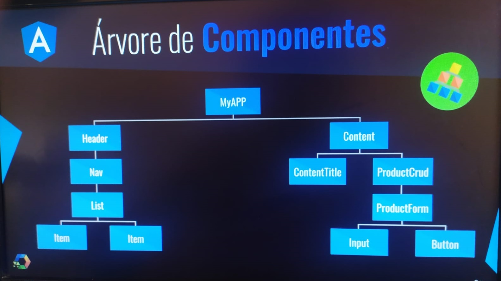

# Curso Web Moderno Completo com Javascript - 2021
## Links:
### Curso da Cod3r:
- url: https://www.udemy.com/course/curso-web

### Aplicações desenvolvidas:
- Seção 21: Projeto Galeria (**Bootstrap/JQuery/Webpack**) -- [Galeria](exercicios-web/bootstrap/projeto-galeria/)
- Seção 23: Projeto Calculadora (**REACT**) -- [Calculadora](exercicios-web/react/calculator)
- Seção 24: Projeto de Cadastro de Usuários (**REACT**) -- [CRUD](exercicios-web/react/crud/)
- Seção 27: Projetos **Vue** -- [QRCode](exercicios-web/vue/qrcode/)
- Seção 28: Calculadora (**Vue**) -- [Calculadora](exercicios-web/vue/calculator/)
- Seção 29: Projeto MontyHall (**Vue**) -- [MontyHall](exercicios-web/vue/montyhall/)
- Seção 30: Aplicação Desktop com **Javascript, ElectronJS e VueJS** - [Most Used Words](exercicios-web/vue/most-used-words/)

## VSCode:

### Atalhos:
- `CTRL + ALT + N`: Executa o arquivo de código no VSCode
- `CTRL + ALT + M`: Para a execução no VSCode
- `WIN + PRINTSCREEN`: Faz um print da tela inteira, incluindo da Udemy, MENOS OS VIDEOS(ABRIR NO MOOZILA).

### Modos de execução do Javascript
- Ferramentas Online:
  - repl.it
  - jsfiddle
- Editor de texto (VSCode, Atom,...)
- Browser (Chrome, Firefox, Brave, Opera, ...)
- Node (Muito usado no backend)
### Extensões:
- CodeRunner: Permite rodar comandos javascript pelo VSCode
- vscode-database: Permite rodar comando SQL diretamente do VSCode.
  - Erros:
    - `MySQL Error: Error: ER_NOT_SUPPORTED_AUTH_MODE: Client does not support authentication protocol requested by server; consider upgrading MySQL client`: solução --> `ALTER USER 'root'@'localhost' IDENTIFIED WITH mysql_native_password BY '123456';` => onde '123456' seria a senha configurada do seu MySQL. Deve ser informado via terminal/cmd utilizando o path do SQL Server: `mysql`.

## Comandos do NPM ou Yarn:
- `npm init`(`npm i`) ou `yarn init`(`yarn i`) ==> Inicializa o projeto node na pasta atual, caso tenha o arquivo `package.json` será feita a instalação de todas as dependências seja com o NPM ou o YARN, caso o arquivo não exista, ele será criado.
- `npm install NomePacote (ou npm i NomePacote)` ou `yarn add NomePacote` ==> Instala um pacote no projeto através do NPM ou do YARN.
  - OBS: Instalando de **maneira global** no node, ou seja, todos os projetos no computador terão acesso
    - `npm install -g NomePacote`
- `npm update NomePacote` ou `yarn upgrade NomePacote` ==> Atualiza um pacote no projeto.
- `npm remove NomePacote` ou `yarn remove NomePacote` ==> Remove um pacote do projeto
- `npm start` ==> Inicializa o servidor local com o NPM ou YARN.
- `npm run dev` ==> Roda a aplicação em modo de desenvolvimento ('dev') executando o módulo que está no package.json na linha `"dev": `.

## Comandos do GULP:
- `gulp --version` ==> Exibe a versão instalada do gulp e do CLI (**C**ommand **L**ine **I**nterface).
- `gulp` ==> Executa o gulp via terminal a partir do arquivo fundamental chamando `gulpfile.js`.


## Pacotes, API, ou programas importantes:
### Dependências importantes do Node:
- **Axios**: É um **client HTTP**. É ideal para fazer e interceptar requisições **REST(GET, PUT,...)**. Faz requisições para obter informações de algo que está remoto. O Axios é baseado em **Promises** do javascript, ou seja, tem-se um promessa de que as requisições trarão uma informação e caso for satisfeita, será tratado os dados conforme o programador tenha solicitado. Ao utilizar promessas, o Axios pode fazer requisições de maneira assíncrona com base no `async` e o `await`.
- **Body-Parser**: Serve para trabalhar com dados vindos do cliente, recebendo e trabalhando com JSON. Pega o padrão **URLENCODE** do body da requisição e trata como um JSON.
  - Instalação: `npm i --save body-parser`
- **Express**: É um framework que auxilia na construção de web-services do lado do backend.
  - Instalação: `npm i --save express@4.16.3 -E`
    - Instala a versao especifica 4.16.3
    - `-E` define que deve ser a versão exata.
- **FileSystem(fs)**: É padrão do node. Responsável tanto por ler quanto por escrever arquivos e verificar os conteúdos de uma pasta.
- **HTTP-Server**: Pacote que possibilita criar um servidor HTTP local para node.
  - Instalação: `npm i http-server`
  - Execução: 
    - `http-server .` ==> '.' representa a pasta atual
    - `http-server -P 9090 .` ==> '.' diretório atual na porta '9090'
  - Desabilita o cache para atualizar a página ao salvar o arquivo: `http-server -c-1 .`
- **JSON-Server**: Dependência que permite criar um servidor local voltado para o JSON, utilizado na aplicação VueJS -> `most-used-words`. Basicamente passando um arquivo JSON ele simula um banco de dados.
- **Lodash**: Uma biblioteca JavaScript que fornece funções úteis para tarefas comuns de programação usando o paradigma de programação funcional.
  - Instalação: `npm i lodash`
- **Nodemon**: Esse módulo irá monitorar todas as alterações nos arquivos de sua aplicação e reiniciar automaticamente o servidor quando for necessário. Fica fazendo Refresh na aplicação atualizando a cada mudança salva.
  - Instalação Global: `npm i -g nodemon`
  - Para rodar os scripts: `nodemon script.js`
  - Reinicia o nodemon: comando `rs`
  - Parar o nodemon: `CTRL + C`
- **Node-Schedule**: Agendador de tarefas, em outras palavras, um temporizador que possibilita projetar uma tarefa para ser executada de tempos em tempos.
  - Instalação: `npm i node-schedule`

### Programas:
- **POSTMAN**: É um programa que possibilita fazer requisições **REST(GET, PUT, POST, PATCH...)** de maneira mais fácil. Muito útil para testar requisições ao servidor tanto local quando já hospedado online.

## Anotações:

<!-- 
Caso precise ocultar muitas informações, basta o usuario expandir
<details>
  <summary>Clique aqui para expandir o conceito!</summary>
</details> 
-->
#### Conceitos Gerais:
- **API REST**:
- Representational State Transfer (**REST**), em português Transferência Representacional de Estado, é um estilo de arquitetura de software que define um conjunto de restrições a serem usadas para a criação de web services (serviços Web). Os Web services que estão em conformidade com o estilo arquitetural **REST**, denominados Web services **RESTful**, fornecem interoperabilidade entre sistemas de computadores na Internet. Os Web services **RESTful** permitem que os sistemas solicitantes acessem e manipulem representações textuais de recursos da Web usando um conjunto uniforme e predefinido de operações sem estado. Outros tipos de Web services, como Web services **SOAP**, expõem seus próprios conjuntos de operações arbitrários.
  - Em um Web service **RESTful**, as solicitações feitas ao URI de um recurso provocará uma resposta com uma carga útil formatada em HTML, XML, JSON ou algum outro formato. A resposta pode confirmar que alguma alteração foi feita no recurso armazenado e a resposta pode fornecer links de hipertexto para outros recursos ou conjuntos de recursos relacionados. Quando o **HTTP** é usado, como é o mais comum, as operações (métodos **HTTP**) disponíveis são **GET, HEAD, POST, PUT, PATCH, DELETE, CONNECT, OPTIONS e TRACE**.
- **Árvore de Componentes**: Serve para qualquer framework baseado em componentes(Angular, React, VueJS, Flutter, etc.).



- **Babel** em Javascript:
  - É uma plataforma ou framework que permite compilar e testar o javascript do 'futuro', ou seja, com as mais novas funcionalidades lançadas, em outras palavras, é muito útil para testar códigos de javascript e ter como resultado o mesmo código mas adaptado para executar na maioria dos browsers.
    - link: https://babeljs.io/
- **Banco de Dados Relacional**:
  - **Relacional**: Apresenta esquema e restrições.
  - **Modelo Entidade/Relacionamento**: É o paradigma o qual se baseia o banco de dados. Entidade seriam as tabelas.
    - Colunas(Classes em OO): Atributos;
    - Linhas ou Tuplas(Instancias em OO): Os dados;
    - Exemplo: Carros 
    
    |  id | marca   | ano   | chassi  | cor  |
    |---|---|---|---|---|
    | 01  | Fiat  | 2010  | 2314897  | preto  |
    |  02 | Ford  | 2018  |  164798 | prata  |
  - **Chave Primária** (**P**RIMARY **K**EY):
    - Única
    - Não vazia;
    - Não muda;
    - Exemplo: Cliente
    
    |  cod. | nome   | email   | CPF  | 
    |---|---|---|---|
    | 1  | Ana  | su@boni.id  |  ...  |
    |  2 | Bia  | datiwisoz@wuvhe.sz  | ...  |
    |  2 | Camila  |  wowefna@jawos.dj | ...  |

    - **Surrogate Key**: Chave sintética, valores gerados artificialmente que não há nenhum valor significativo para o usuário com a ideia de ser único na tabela toda.
    - **Natural Key**: Valor único natural do objeto na tabela, por exemplo, no cadastro de pessoas poderia ser o CPF, RG, ...
      - Problema: Se inverter CPFs ou a chave de um ir pra outro, ficará muito mais trabalhoso inverter, portanto via de regra utilizamos mais "Surrogate Key".
    - Chave primária pode ser composta por mais de uma coluna, por exemplo C1 e C2, poderá haver repetições em C1 e C2 de maneira isolada mas nao em conjunto.
  - Chave Estrangeira (**F**oreigner **K**ey): Quando ocorre uma relação entre duas tabelas, o atributo de uma tabela terá uma chave estrangeira na outra tabela, ou seja, a chave primaria tabela A ficará como chave estrangeira na tabela B.
  - **SQL**: É dividida em 4 partes:
    - **DML** (Data Manipulation Language): Comandos do tipo `SELECT`, `INSERT`, `UPDATE`, `DELETE`. Basicamente as operações de CRUD, ou seja, manipular dados.
    - **DDL** (Data Definition Language): Comandos do tipo  `CREATE`, `ALTER`, `DROP`. No geral, são comandos que são relacionados a estrutura, ou seja, a definição do esquema do banco de dados.
    - **DCL** (Data Control Language): Comandos relacionados a segurança do banco de dados. `GRANT`, `DENY`, `REVOKE`.
    - **TCL** (Transaction Control Language): Comandos relacionados as transações do banco de dados. `BEGIN TRANS`, `COMMIT TRANS`, `ROLLBACK`.
      - Exemplo: Caso de transferência de dinheiro entre contas de dois bancos diferentes, o valor não pode simplesmente ser removido do banco A e adicionado ao B, pois são banco de dados diferentes, além disso é completamente inseguro porque pode ocorrer da transação falhar. Resumidamente, ou todas as operações são efetivadas ou nenhuma.
  - Comandos do MySql:
    - `mysql -u root -p`: Inicializa o mysql com todos os acessos via terminal/cmd
      - **OBS**: No Windows pode ser necessário adicionar a pasta 'bin' do MySQL Server como variavel de ambiente.
    - `CREATE SCHEMA Nome_esquema;`: Cria o esquema do banco de dados;
    - `USE Nome_esquema;`: Abre o banco de dados de schema 'Nome_esquema';
    - `quit;` ou `exit;`: Finaliza o processo e sai do mysql;
  - **UPDATE SEM WHERE**: É extremamente perigoso fazer isso pois irá atualizar a TABELA INTEIRA e nao somente uma linha.
  
- **Banco de dados Não-Relacional(NoSQL)**:
  - Representa um tipo de banco de dados *Not Only SQL*(não-relacional), ou seja, não somente SQL e de certo modo não descarta o SQL completamente. 
  - Vale salientar que não se deve confundir com **não-SQL**.
  - **Não Relacional**: Não apresenta esquema(estruturas, tabelas e relacionamentos).
    - Ao utilizar o MongoDB, lembrar de criar uma pasta 'data/db' na raiz da unidade do windows.
  - Pode ser categorizado da seguinte forma:
    - **Chave-valor** (*Key-value database*): São muito utilizados em jogos, publicidade online e na Internet das coisas (IOT). Sendo caracterizado pelo fato de serem altamente particionáveis e permitirem escalabilidade horizontal. Os dados são armazenados no padrão chave-valor como uma tabela hash.
      - Exemplos: MemcacheD, Riak, REDIS;
    - **Grafos**: Armazena os dados na forma de grafos, utilizando vértices, arestas. É muito utilizado em aplicações que os dados precisam estar altamente conectados. Os casos de uso mais comuns são as redes sociais, detecção de fraude, mecanismos de reconhecimento e criação de gráficos de conhecimento.
      - Exemplos: Property Graph, RDF(*Resource Description Framework*), Neo4j. Giraph;
    - **Colunar**(ou orientado a colunas): Armazena dados em linhas particulares de tabelas no disco. É otimizado para recuperação rápida de coluna de dados. Muito utilizado para consulta analítica pois reduz a entrada e saída em disco diminuindo a quantidade de dados que precisa carregar.
      - Exemplos: Cassandra, Hbase; 
    - **Pesquisa**: Construído especialmente para indexação, agregação e pesquisa de dados semi-estruturados. Pensado ainda mais para alta performance, baixa latência e análise de dados.
      - Exemplos: Amazon ES, Expedia.
    - **Documentos**: Também conhecido como modelo de dados semi-estruturados, ele armazena os dados como documentos. Os documentos são independentes o que torna mais fácil distribuir em uma malha de servidores.
      - Documentos podem ser criados por chave-valor ou por JSON.
      - Exemplos: MongoDB, CouchDB;
  - Vantagens:
    - 1 - Flexibilidade: Num mundo cada vez mais ágil(Desenvolvimento ágil), trabalhar com uma estrutura flexível é na maior parte dos casos o que será adotado.
    - 2 - Escalabilidade: São pensados justamente na escalabilidade-horizontal, ou seja, distribuindo dados em clusters, ao invés dos JOIN pesados do SQL.
    - 3 - Disponibilidade: Oferecem uma arquitetura replicação de dados visando diminuir os problemas de disponibilidade de recursos. Cada vez que um nó do cluster caia, outro poderá assumir o lugar.
    - 4 - OpenSource: Garante o crescimento rápido e sua popularidade.
    - 5 - Infraestrutura e baixo custo operacional: O custo para adaptar um banco de dados relacional para não-relacional é baixo.
    - 6 - Recursos especiais:
      - Adaptado a APIs RESTFULL;
      - Replicação automática;
      - Indices especiais;
      - Consultas a dados geoespaciais;
- **Frameworks**:
  - É um arcabouço o qual a aplicação é construída em cima, através dela é possível ter uma base para construir as aplicações. há tanto Frameworks para backend com o objetivo de persistir banco de dados, por exemplo, quanto para o FrontEnd na parte visual com o Angular.
- **GIT**: É basicamente um método realizar o versionamento do seu código, criar backups e facilitar o trabalho em equipes através de suas **branchs**.
- Padrão de projeto *Chain of Responsability ou Middleware*: 
  - É um padrão muito presente na web e no node. A ideia é diminuir o acoplamento de funções garantindo uma maior liberdade e utilizando a cadeia de funções com uso de **NEXT** para indicar o próximo passo.
- Qual a diferença entre o **NPM** e o **YARN**?
  - Basicamente o YARN também é um gerenciador de pacotes e foi criado pelo facebook com o objetivo de ser mais rápido e seguro que o NPM, além disso ainda possibilitar instalar pacotes offline.
- **SEO (Search Engine Optimization) - Otimização para motores de busca**:
  - Otimização de Sites (otimização para motores de pesquisa ou otimização para mecanismos de busca é o conjunto de estratégias com o objetivo de potencializar e melhorar o posicionamento de um site nas páginas de resultados orgânicos - desconsiderando links patrocinados/pagos - nos sites de busca gerando conversões, sejam elas, um lead, uma compra, um envio de formulário, agendamento de consulta e outros.
- **Single-Page Application(SPA)**: O html é gerado dinamicamente a partir do Javascript
- **Tipagem Forte**: É quando atribuído um tipo para a variável não poderá ser mudado.
#### Conceitos Específicos:
- **AJAX**:
  - Ajax (acrônimo em língua inglesa de <em>**A**synchronous **J**avascript **a**nd **X**ML</em>, em português "Javascript Assíncrono e XML") é o uso metodológico de tecnologias como Javascript e XML, providas por navegadores, para tornar páginas Web mais interativas com o usuário, utilizando-se de solicitações assíncronas de informações.
  - A **XMLHttpRequest** (XHR) tem um papel importante na técnica de desenvolvimento web Ajax para se comunicar com os scripts do lado do servidor. Mais recentemente foi lançado o **Fetch API**, que possui funcionalidade semelhante ao XHR com linguagem em mais alto nível.
  - Com o AJAX da pra trabalhar com JSON também. Resumidamente, o AJAX é voltado para trabalhar com requisições assíncronas de maneira mais eficiente.
- **Angular:**
  - É um framework Javascript desenvolvido pelo Google para a criação de **aplicações web SPA(Single-Page Application)** baseada em **componentes**.
  - O Angular trabalha por padrão com o TypeScript.
  - Houve uma migração da versão 1 do Angular para a versão 2 em diante.
    - **A versão 1 é chamada de AngularJS**.
    - É um framework bem diferente da versão 2 em diante, não somente pelo fato de trabalhar com componentes quanto outros fatores.
    - O Angular utiliza fortemente a CLI(Command Line Interface)
      - **Instalação**: `npm i -g @angular/cli`
      - **Criar a aplicação**: `ng new minha-app`
      - **Criar a aplicação com o mínimo pra funcionar, retirando a parte de teste de software**: `ng new minha-app --minimal`
      - **Inicia o projeto e faz a compilação dos arquivos**: `npm start`
  - Inicialização da App do Angular:
    - main.ts: Primeiro arquivo que será chamado pra inicializar a aplicação Angular.
    - AppModule: É o módulo da aplicação que será chamado a partir do arquivo main.ts
      - Observação importante: O Angular permite restringir componentes a determinados módulos, ou seja, permite um maior acoplamento evitando que seja importado e visualizado em lugares indevidos. React e Vue isto não ocorre.
      - Dentro do AppModule há um atributo chamado 'Bootstrap' que aponta para o componente 'AppComponent', sendo este o componente padrão.
  - Detalhes importantes:
    - **Decorator**: É um padrão de projeto que visa a troca de trabalhar com herança para trabalhar com composição para estender um determinado objeto.
      - São os '@' que o angular utiliza, como o '@Directive' por exemplo.
    - Dentro do arquivo **angular.json** vem todas as configurações relativas ao angular:
      - **"inlineTemplate"** e **"inlineStyle"**: Representam que os componentes criados terão o **HTML + CSS + Typescript** em um arquivo **ÚNICO** ou em arquivos **SEPARADOS**.
    - Dependências ou módulos do Angular:
      1. `ng add @angular/material`: Tem uma série de **componentes** interessantes que auxiliam a construir uma aplicação seguindo o **padrão do google**.
      2. `MatToolbarModule` do material design.
    - `ng generate component components/template/header` ou `ng g c components/template/header`: Cria o componente 'components/template/header'.
    - **Assuntos importantes**:
      - **Componente Angular**: Basicamente segue a ideia de um objeto que apresenta HTML, CSS e TS que define como ele se comportará.
        - Exemplo de um componente chamado 'home' que terá os seguintes arquivos: `home.component.css`, `home.component.html` e `home.component.ts`. Além disso, gera a tag personalizada `<app-home></app-home>`
        ```Typescript
        import { Component, OnInit } from '@angular/core';

        @Component({
          selector: 'fenix-home',
          templateUrl: './home.component.html',
          styleUrls: ['./home.component.css']
        })

        export class HomeComponent implements OnInit {
          constructor(){  }

          ngOnInit(): void {

          }
        }
        ```
        - **Os componentes se agrupam em módulos conforme a representação em árvore**
      - **Diretivas**
        - Há 2 tipos de diretivas:
          - **Diretiva de Atributo**: Altera a **aparência**(Mexer no CSS, por exemplo) e o **comportamento** de um elemento, componente ou outras diretiva. 
          ```typescript
          @Directive({    // Decorator
            selector: '[appRed]
          })
          export class RedDirective{
            constructor(el: ElementRef){
              el.nativeElement.style.color = '#e35e6b';
            }
          }
          ```
          ```Typescript
            //Aplicando a diretiva de atributo
            <i class="material-icons v-middle" appRed>
              favorite
            </i>
          ```
          - **Diretiva Estrutural**: Altera o layout **adicionando** e **removendo** elementos da **DOM**.
          ```typescript
          <form *ngIf="product" class="product-form>  </form>
          ```
          ```typescript
          <ul>
            <li *ngFor="let product of products">
              {{ product.name }}
            </li>
          </ul>
          ```
      - Property **Binding**: Como o componente possui é um conjunto "amarrado" entre HTML, CSS e TS, logo para se utilizar um atributo da classe TS no HTML de modo que mantenha esta amarração e aponte para a mesma variável ou atributo é **utilizando colchetes**. Por exemplo, no html preciso verificar o atributo **products** que está na classe TS, para isso será utilizado `[dataSource]="products"`.
      ```html
      <table [dataSource]="products">   </table>
      ```
      - Event **Binding**: Como ligar um evento que está no HTML com um método que está no TS?!? Para isto, será utilizado a sintaxe dos **parenteses**.
      ```HTML
      <button mat-raised-button
        (click)="createProduct()"
        color="primary" > 
        Salvar 
      </button>
      ``` 
      - One Way Data **Binding**: Seria a forma padrão do Property Binding, basicamente a amarração de atributos a partir de um lado, ou seja, no sentido da componente para o HTML, por exemplo: Suponhamos que temos a variável `nome: string`(sendo Rebecca o nome) no arquivo TS e no HTML temos `<input [value]="nome">`(Rebecca será preenchida no campo) referenciando o atributo, em seguida resolvemos mudar o nome para "Ana" no componente(Typescript), em seguida, irá mandar uma notificação para o HTML que atualizará o nome no campo para "Ana" também.
      - Two Way Data **Binding**: Amarração de atributos a partir de AMBOS os lados, ou seja, no sentido da componente para o HTML e de HTML para componente, por exemplo: Suponhamos que temos a variável `nome: string`(sendo Rebecca o nome) no arquivo TS e no HTML temos `<input [(ngModel)]="nome">`(Rebecca será preenchida no campo) referenciando o atributo, em seguida resolvemos mudar o nome para "Ana" no componente, em seguida, irá mandar uma notificação para o HTML que atualizará o nome no campo para "Ana" também. Contudo, o contrário também é válido, se o nome for mudado no HTML, também será modificado no arquivo TS do componente.
    - **Angular Router**: Estabelece as rotas de navegação entre os componente, ideia parecida com o React-Router-DOM, contudo, no Angular a componente será injetada no **Router Outlet**.
      - Exemplo: Em um link para Produtos representado pela tag '`<a routerLink="/products">Produtos</a>`', será adicionado o atributo '`routerLink="/products"`' que estabelece a rota para produtos, em seguida na lista de rotas será buscado o component de path '`products`' e será injetado na tag `<router-outlet></router-outlet>`.
    - **Angular Pipes(pipe: '|')**: São processamentos feitos em cima de variáveis, geralmente presente entre **double-mustaches**:` {{ variavel }}`
      - Sua utilização é presente quando, por exemplo, se recebe um valor do banco de dados e é desejado fazer um tratamento nele antes de exibir para o usuário, tal como formatar com o símbolo monetário: `<p>O vencimento é {{ produto.vencimento | date: 'fullDate' | uppercase }}</p>` ==> Encadeamento('Chaining') de pipes.
    - **Programação Reativa(ReactiveX)**: Um código que atua de forma proativa irá ficar tentando fazer algum tipo de processamento, deste modo, consumindo mais processamento, ou seja, fica "perguntando" a todo momento se há algo que precisa ser feito, assim, não é tão desejado um programa que trabalhe dessa forma, o contrário é o padrão de programação reativa que o código será executado somente se houver uma ação ou evento externo para ser executado.
      - No Angular tem a framework associada: `import { Observable} from "rxjs";`
      - **Padrão Observer**: É um padrão orientado a **eventos**, os elementos observadores(do tipo "observer") serão registrado no elemento do tipo "Subject", e quando houver um evento determinado, o subject irá notificar os observadores.
      - Entendendo **Observables**: Callbacks ==> Promises(Só pode ser executado uma única vez, facilita aninhamentos) ==> Observables(Reusável, Stream de dados(Exemplo: Observar uma votação, de tempos em tempos olha o servidor para atualizar a informação), Operadores(filter, map,...))
    - **Services**: São classes que têm como principal objetivo **organizar** e **compartilhar** métodos e dados entre **componentes**.
      - Comando: `ng g s services/product`
      ```typescript
        @Injectable({     //Decorator que possibilita ser injetada em outra classe
          providedIn: "root",   // root é um injector do AppModule
        })
        export class ProductService{
          //...
        }
      ```
    - **Injeção de Dependências**: É um padrão no qual a classe recebe as **dependências** de uma **fonte externa** ao invés de criar por conta própria.
    
    .jpeg "Injeção de Dependência - 01")
    .jpeg "Injeção de Dependência - 02")

      - Services são **Singletons** (Instância única) dentro do escopo de um injector(ModuleInjector(**@NgModule** ou **@Injectable**), ElementInjector(**@Directive** ou **@Component**))
  - Anatomia do módulo:
  
  

- [**Bootstrap**](exercicios-web/bootstrap/README.md):
  - Bootstrap.css é um framework CSS que organiza e gerencia o layout de um site. É um framework que tem uma grande quantidade de estilos e funcionalidades voltadas para o CSS.
  - A framework depende do JQuery.
  - Opções de instalação: (Via NPM, Via site, Via CDN(pega de um servidor de alto desempenho na entrega de arquivos estáticos ao invés de deixar no próprio servidor)
- [**CSS**](exercicios-web/css/README.md):
  - É um meio de atribuir estilos na página html.
- **ECMAScript (JAVASCRIPT)**: É o nome formal da linguagem Javascript. Javascript é uma linguagem fracamente tipada(tipagem dinâmica).
- **ElectronJS**: Possibilita a criação de aplicações desktop Multiplataformas(MacOS, Linux, Windows, todos usando o mesmo código) usando as tecnologias da Web como Javascript, CSS e HTML. O VSCode e o Atom, por exemplo, são feitos com o ElectronJS.
- **GatsbyJS**:
  - É uma framework escrita em JavaScript e React, cuja proposta é ajudar desenvolvedores a construir aplicações e websites de forma facilitada. O foco do Gatsby é proporcionar um desenvolvimento rápido, efetivo e performático, acima de tudo.
  - A forma que ele funciona consiste em três etapas. Primeiro, você tem o Data Source, que é basicamente a fonte desses dados que você vai entregar pra construir o web site ou uma aplicação, como um blog, por exemplo.
  - E, depois, vem o processo de building, onde ele vai incorporar todo HTML, JavaScript e CSS que são necessários para compilar sua aplicação, lendo em cima dessa fonte de dados e construir o site estático.
  - O conceito do Gatsby é ler esses dados, construí-los de forma estática, criando um site estático, que é o que dá, de fato, essa performance para ele. Por fim, a terceira etapa é o Deploy, onde você entrega esses arquivos e os visualiza na web.
- [**Gulp**](exercicios-web/gulp/README.md):
  - Gulp.js é uma ferramenta de automatização de tarefas em JavaScript. Tarefas como minificar, otimizar e compilar arquivos, tão repetitivas e necessárias ao desenvolvimento, podem ser automatizadas com o Gulp.
  - É usado principalmente no contexto Frontend. Trabalha com plugins ideal para cada cenário.
  - Ferramentas similares:
    - GRUNT;
    - WebPack;
  - Utiliza os Streams do Node.js pra escrever os arquivos diretamente no disco.
  - Plugins:
    - **GULP-UGLIFY** ==> Serve para minificar arquivos usando o UGLIFY.js
    - **GULP-CONCAT** ==> Concatena arquivos em um único arquivo.
      - Exemplo: Junta todos os arquivos .js em um arquivo único.
    - **GULP-IMAGEMIN** ==> Otimiza imagens PNG, JPG, GIF e SVG.
  - No arquivo **GULPFILE.js** estarão as tarefas que o programador deseja que o GULP automatize.
  - *Além disso o GULP necessita que instale o* **CLI(LINHA DE COMANDO NO TERMINAL)** *dele*:
    - Comando: `npm install -g gulp-cli` ==> Instalado de maneira global
  - funções principais:
    - `gulp.task(name, fn)`: Irá registrar a função com um nome, podendo especificar uma dependencia caso uma tarefa seja necessario rodar antes dela.
    - `gulp.run(tasks...)`: Executa todas as tarefas com o máximo de simultaneidade.
    - `gulp.watch(glob, fn)`: Observa os arquivos indicados e quando uma alteração for feita, o gulp executará novamente a função.
    - `gulp.src(glob)`: Retorna um 'Readable Stream', ou seja, um Stream liberado para a leitura. Basicamente carrega os arquivos.
    - `gulp.dest(folder)`: Retorna um 'Writable Stream', ou seja, um Stream liberado para a escrita. Basicamente a pasta de destino onde serão salvos os arquivos.
- **JQuery**:
  - É uma biblioteca javascript muito popular, ajuda a buscar elementos na DOM. Trabalha com eventos e Ajax, utiliza os seletores do CSS, permite fazer o encadeamento de chamadas, fácil criação de plugins, suporte amplo nos browsers.
  - Pontos negativos:
    - A web está migrando para trabalhar componentes (Angular, React, vie,...), contudo, um caminho contrário ao JQuery.
- **MongoDB**:
  - É um banco de dados **não-relacional** **orientado a documentos**.
  - MongoDB Compass: É uma interface gráfica que visa faciliar a utilização da ferramenta, contudo, da pra fazer tudo via linha de comando.
  - RoboMongo (Robo 3T/studio 3T): Ferramenta semelhante ao MySQL Workbench para trabalhar com interface gráfica no MongoDB.
  - Comandos:
    - `show dbs`: Mostra as databases presente no MongoDB;
    - `use NomeBase`: Troca para a base de dados determinada;
    - `show collections`: Mostra as collections de documentos que estão presente na base de dados;
    - `db.createCollection("item")`: Cria uma collection chamada "item";
    - 
      ```Javascript
      // Adiciona 1 documento na collection
      db.item.insert({
        "name": "Item 1",
        "price": 10.0
      })

      // Adiciona vários documentos na collection
      db.item.insertMany([
      {
        "name": "Item 2",
        "price": 20.0
      },
      {
        "name": "Item 3",
        "price": 30.0
      }
      ])
      ```
      Insere um documento na collection "Item".
    - `db.item.find()`: Retorna os registros inseridos na collection "item". Também é possível limitar o número de elementos da buscas da seguinte forma: `db.item.find().limit(1)`.
    - `db.item.find({_id: ObjectId("123456789")})` ou `db.item.find({name: "Item 2"})`: Retorna o documento que tem um parâmetro especifico.
    - `db.item.find({name: "Item 2"}, {_id: 0, name: 1})`: Retorna o documento de nome "Item 2" mas na consulta vai ocultar o 'id' e mostrar somente o 'name'.
    - `db.item.find().count()`: Conta quantos documentos tem na collection 'item'.
    - `db.item.remove({_id: ObjectId("123456789")})`: Remove o documento da collection 'item'.
    - 
      ```Javascript
      // Atualiza o atributo 'price' do documento de id 'ObjectId("123456789")'
      db.item.update(
        {_id: ObjectId("123456789")},
        {$set: {$price: 30.00}}
      })
      ```
      Atualizando dados de um documento.
    - `db.item.find({price: {$gt: 25}})`: Retorna documentos com 'price' MAIOR que 25.
    - `db.item.find({price: {$eq: 25}})`: Retorna documentos com 'price' IGUAL a 25.
    - `db.item.find({price: {$lt: 25}})`: Retorna documentos com 'price' MENOR que 25.
    - `db.item.find({price: {$in: [20.0, 30.0]}})`: Retorna documentos com 'price' OU 20 OU 30.
    - `db.item.find({price: {$ne: 30}})`: Retorna documentos com 'price' DIFERENTE de 30.
    - `db.item.find({price: {$nin: [20.0, 30.0]}})`: Retorna documentos com 'price' NEM 20 e NEM 30.
    - `db.item.find({$and: [{name: "Item 12"}, {price: 30.0}]})`: Retorna documentos de 'name' = 'Item 12' E 'price' = 30.0.
    - `db.item.find({$or: [{name: "Item 12"}, {price: 30.0}]})`: Retorna documentos de 'name' = 'Item 12' OU 'price' = 30.0.
- [**React**](exercicios-web/react/README.md):
  - O React é uma biblioteca(framework) JavaScript de código aberto com foco em criar interfaces de usuário em páginas web. É mantido pelo Facebook, Instagram, outras empresas e uma comunidade de desenvolvedores individuais.
  - A ideia principal do React é trabalhar por meio de componentes(visando facilitar a manutenibilidade do código e leitura) podendo serem feitos tanto em typescript quanto em javascript.
  - O React tem sido usado por grandes companhias ao redor do mundo. Algumas delas: Netflix, Airbnb, American Express, Facebook, WhatsApp, eBay e Instagram. Essa é a prova de que a ferramenta tem um número de vantagens que não têm nem comparação nos seus competidores.   
  - O React geralmente utiliza a extensão **JSX** que combina o javascript com elementos HTML ou **TSX** relativo ao typescript.
  - Dependências importantes:
    - **Axios**: Axios é um cliente HTTP baseado em Promises para fazer requisições REST(PUT, GET,...). Pode ser utilizado tanto no navegador quanto no Node.js ou qualquer serviço de API.
    - **react-router**: Estabelece a navegação entre os componentes.
    - **react-router-dom**: O redirecionamento é utilizando o elemento Redirect da biblioteca do react-router-dom. Com ele podemos fazer um redirecionamento de forma declarativa, como se fosse um componente.
    - **font-awesome**: Fonte de ícones e textos. Bem util para as aplicações.
  - **Observação 01**: Todos os componentes criados pelo usuário **DEVEM** ter o nome iniciado por **LETRA MAIÚSCULA**. O nome do arquivo nao precisa mas o nome do componente sim.
  ```JSX
  // O Componente Pai será renderizado corretamente
  import Pai from './componentes/Pai'

  // Contudo já nesse caso 'filho' não sera reconhecido corretamente
  import filho from './componentes/Filho'
  ```
  - **Observação 02**: Não é possível retornar mais de uma tag no mesmo componente sem uma tag de fechamento, contudo, podemos contornar esta situação utilizando um array de elementos, uma div, uma tag vazia ou usando o `React.Fragment`.
  ```JSX
  // Por array 
  export default props => [
      <h1 key='h1'>Bom dia {props.nome}!</h1>,
      <h2 key='h2'>Até breve!</h2>
  ]   

  // Por div ==> Pode ter o layout do componente mudado dependendo do CSS, então, cuidado!
  export default props => 
    <div>
      <h1>Bom dia {props.nome}!</h1>
      <h2>Até breve!</h2>
    </div>
  
  // Por tag vazia 
  export default props => 
    <>
      <h1>Bom dia {props.nome}!</h1>
      <h2>Até breve!</h2>
    </>
  
  // Por React.Fragment
  // Envolve os elementos e nao ocupa espaço no DOM
  export default props => 
    <React.Fragment>
      <h1>Bom dia {props.nome}!</h1>
      <h2>Até breve!</h2>
    <React.Fragment/>
  ```
  - **Observação 03**: Para retornar mais de uma tag através de um ARRAY deve ter o atributo **key** identificando cada elemento dele.
  ```JSX
  // Para trabalhar com array neste modelo, no react é necessario adicionar 
  // key pra cada elemento
  export default props => [
      <h1 key='h1'>Bom dia {props.nome}!</h1>,
      <h2 key='h2'>Até breve!</h2>
  ]   
  ```
  - Tipos de componentes:
    - **Funcional**: É uma função que retorna um elemento JSX
      ```JSX
      import React from 'react'

      // Componente baseado em função
      export default () =>
          <h1>Primeiro</h1>
      ```
    - **de Classe**: É uma classe de um objeto que, diferentemente do funcional, pode apresentar estados,  métodos de ciclo de vida (Chamar um trecho de código antes de um componente ser renderizado, Chamar um trecho de código quando o componente for destruído,...).
      - **Observação**: Quando é um componente de classe, a classe criada herdará os métodos e atributos do `Component` do React, e portanto, deve-se importa-lo também.
       
      ```JSX
      import React, { Component } from 'react'

      // Componente baseado em classe
      export default class Saudacao extends Component {
        render(){
          const {tipo, nome} = this.props // Desestrutura e retira os atributos nome e tipo das propriedades
          return (
            <div>
              <h1>{tipo} {nome}!</h1>
              <hr/>
            </div>
          )
        }
      }
      ```
        - Os atributos presente no props **NAO PODEM** ser alterados se não forem **STATE**, logo ocasionará em um erro caso isso for feito: `TypeError: Cannot assign to read only property 'tipo' of object '#<Object>'`('tipo' presente em props)
          ```JSX
          // Alternativas para criar um state
          // (01)
          state = {
            tipo: "Fala",
            nome: "Pedro"
          }

          this.setState({tipo: "Tchau", nome: "João"})  // Sobreescreve os valores do state
          // ou somente o tipo
          this.setState({tipo: "Tchau"})  
          // ou somente o nome
          this.setState({nome: "João"})  

          // (02)
          import { useState } from 'react';

          // Define o estado e a função que a altera o estado
          const [myLinks, setMyLinks] = useState([])    // Estado de array
          const [data, setData] = useState({})          // Estado de objeto
          const [showModal, setShowModal] = useState(false) // Estado de booleano
          const [emptyList, setEmptyList] = useState(false)

          ```
        - Diferença entre o `BrowserRouter` e `HashRouter` ambos podem ser utilizados para estabelecer as rotas entre os componentes e paginas da aplicação, contudo, o `BrowserRouter` estabelece a url de navegação muito igual aos sites sem o hash '#':
          - http://localhost:3000/
          - http://localhost:3000/users
          - http://localhost:3000/home
        Já o `HashRouter` adiciona um hash '#' na url meio que identificando a raiz da página:
          - http://localhost:3000/#
          - http://localhost:3000/#/users
          - http://localhost:3000/#/home
        Utilizar o BrowserRouter para a build em produção pode requerer alguns ajustes nas rotas principalmente quando for utilizado um servidor apache ou outros, já o HashRouter não, ele identifica a raiz da pagina sendo '/#' e identifica todas as rotas.
- **Redux**: Redux é uma biblioteca para armazenamento de estados de aplicações JavaScript, ela tira a responsabilidade de um componente ter um estado que poderá ser usado por vários outros componentes dentro da sua aplicação e passa isso para um objeto global, que pode ser acessado por qualquer componente a qualquer momento.
  - Ele basicamente tira a responsabilidade de cada um dos componentes de armazenar os estados, deixando tudo isso centralizado, sendo utilizado ao mesmo tempo por todos os componentes de forma compartilhada. Ele também roda em diferentes ambientes como servidor, cliente e nativo.
  - Redux é comumente aplicado em conjunto a frameworks como React, Vue, Ember, Angular,... mais comumente no React, contudo, REDUX NAO DEPENDE DO REACT.
  - Fazendo o uso do Redux todos esses estados ficarão armazenados em uma árvore de objetos através do store. Para que isso aconteça, o Redux utiliza 3 recursos:
    - **Store**: você pode pensar em store como um container ou um grande centro de informações, que tem disponibilidade para receber e entregar o que o seu componente requisita. A store armazena de forma centralizada todos os estados da aplicação. Vale ressaltar que a store é imutável.
    - **Actions**: São ações disparadas da aplicação para o store. Elas são criadas através das action creators. As actions são a única forma de acionar uma mudança de estados no store.
    - **Reducers**: Cada dado da store deve ter o seu próprio reducer. Ele é encarregado de lidar com todas as ações e especificam como o estado da aplicação irá mudar de acordo com a action que foi enviada para o store.
  - Principios do Redux:
    - **Todos os estados estarão disponíveis exclusivamente através do store**: todo o estado da sua aplicação vai estar armazenado nesse store que é único, onde todos os componentes vão consultar nesse store.
    - **Os estados são somente leitura**: os componentes não podem fazer uma manipulação direta nas informações que estão nele.
    - **As alterações são feitas através de funções puras**: o Redux utiliza o conceito de programação funcional, por isso toda alteração no store é feita através de uma função pura, chamada de reducer. O reducer recebe o estado e a ação, onde com essa ação nós visualizamos o que precisa ser alterado no estado e o reduce entrega uma nova store do nosso estado da aplicação.
  - **State Dealing**: Problema que um componente A precisa compartilhar estado para um Componente B mas os dois são de ramos diferentes da árvore que nao chega nem próximo.
- **SASS**:
  - É um pré-processador CSS, com isso, permite adicionar novas funcionalidade aos CSS que nao está presente no padrão e através disso permite criar arquivos CSS com maior nível de reúso.
- **TypeScript**:
  - Linguagem criada pela Microsoft.
  - Tudo que é suportado no JavaScript é suportado no TypeScript. o TypeScript é um superconjunto de javascript pois no final o código será convertido pra javascript para poder ser executado com mais facilidade nos navegadores e outras plataformas.
  - O core do TypeScript seria possibilitar definir tipos no JavaScript, ou seja, uma linguagem tipada.
  - **O código escrito em Typescript é compilado para Javascript**.
  - Orientada a objetos e **Tipagem Forte**.
  - Recursos interessantes: Decorator e Interfaces.
- [**VueJS**](exercicios-web/vuejs/README.md):
  - É um framework muito usado, contudo não é mantido por uma empresa como ReactJS-Facebook e AngularJS-Google, logo é mantido pela própria comunidade.
  - É um framework JavaScript open source para a criação de aplicações web, criado por Evan You em 2014. O Vue.js possibilita criar aplicações de forma reativa. O Vue.js faz a utilização de um DOM virtual, o que faz com que seja extremamente performático na maioria das situações. Além disso, conta com uma arquitetura muito bem estruturada por meio da criação de componentes reusáveis.
  - Este framework é muito utilizado para criar aplicações **SPA (Single Page Applications)** e também para desenvolver vários outros tipos de interfaces, com foco na interação e experiência do usuário. Atualmente e não à toa, o Vue.js está entre os frameworks Javascript para criação de interfaces mais populares do mundo, devido à sua baixa curva de aprendizado, sua versatilidade e por oferecer uma solução bem completa – contando até mesmo com uma CLI(linha de comando), o Vue CLI.
  - Principais características: 
    - Progressividade; 
    - Reatividade: Sua arquitetura visual que muda cada vez que tem uma mudança de estado, ou seja, o HTML vai ser atualizado toda vez que o valor de uma variável ou componente em vueJS for alterado.
    - **Extensões e utilitários importantes** para facilitar o trabalho com o vue:
      - **Vue DevTools**(Para Browsers): Ajuda a inspecionar e depurar as aplicações em uma interface mais amigável.
      - **Quasar**: É uma solução para cross-plataform usando o vue.
        - https://quasar.dev/
      - **Vuetify**: É uma biblioteca de componentes auxiliar do Vue voltada materiais de design de interfaces.
  - Geralmente a partir de um trecho de html como uma 'div' por exemplo, o vue pode ser responsável e controlar a renderização e comportamento daquele elemento desde que associe um <i>Vue Instance</i> ao trecho de html e logo este trecho será controlado pelo Vue.
- **Webflow**:
  - Com esta plataforma qualquer cidadão comum ou desenvolvedor consegue criar experiências agradáveis para o consumidor final. Esta poderosa plataforma desenvolvida pela Amazon Web Services está ajudando centenas de empreendedores ao redor do mundo.
  - Trata-se de uma proposta elaborada pela Amazon Web Services que permite construir sites responsivos sem a necessidade de ficar digitando linhas de código intermináveis, o Webflow faz com que o site seja adaptado para diferentes tamanhos de telas, que podem ser desktops, tablets e smartphones. 
- [**Webpack**](exercicios-web/webpack/README.md):
  - Apresenta uma finalidade similar ao GULP no sentido de minificar arquivos e realizar tarefas, contudo, a diferença é que o GULP trabalha com TASKs, ou seja, tarefas a serem executadas e utiliza o padrão PIPE para executar as tarefas, já o **webpack é diferente pois trabalha com módulos**.
  - **<u>Importante</u>**: O Webpack apresenta <u>um **módulo de entrada**</u> nas configurações e só vai conseguir chegar em outros módulos somente se tiver `import` seja no módulo principal ou nos subsequentes.
    - O mesmo vale para imagens, arquivos de texto, fontes, CSS e afins... O loader irá reclamar se nao tiver importado em algum lugar.
  - Padrão de módulos:
    - **CommonsJS**: O node se baseia neste modulo, com module.exports e toda a configuração.
    - webpack: Padrão oficial da linguagem, implantado no ECMAScript 2015. Este sistema de módulos é baseado em `port` e `exports`.
  - O webpack apresenta um sistema de `loader`, o que significa que dependendo da extensão do arquivo ele vai aplicar um tipo de lógica para renderizar aquele arquivo.
- **Wordpress**:
  - **WordPress** é um sistema livre e aberto de gestão de conteúdo para internet (do inglês: *Content Management System* - CMS), baseado em **PHP** com banco de dados **MySQL**, executado em um servidor interpretador, voltado principalmente para a criação de páginas eletrônicas (sites) e blogs online.
  - É uma das ferramentas mais utilizadas para conteúdo na web, disputando com o serviço do Google, chamado Blogger. No entanto, o WordPress é adotado por aqueles que queiram uma página com maior personalização e recursos diferenciais.
  - O WordPress possui um sistema de modelos, através de um processador de modelos. O usuário pode re-organizar o layout através de widgets sem precisar editar códigos PHP ou HTML; eles também podem instalar e alternar entre temas WordPress. Os códigos PHP e HTML dos temas também podem ser editados para adicionar funcionalidades personalizadas.

<div style="color: #F88">
<h2>Erros Comuns</h2>
</div>

- `Module build failed: ModuleBuildError: Module build failed: Error: Node Sass version 7.0.1 is incompatible with ^4.0.0.`
  - A dependência **node-sass** foi descontinuada, contudo, a dependência atual é o **sass**
    - `npm uninstall node-sass` => Desinstalando o node-sass;
    - `npm install sass` => Instalando o sass;
  - Caso mesmo assim deseja-se instalar o node-sass:
    - `npm install node-sass@(your version)`
    - De preferência usar a versão "7.0.1" que é a última e pode ser ter uma compatibilidade melhor com o nodejs atual.