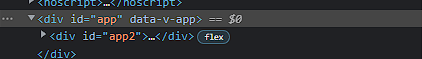
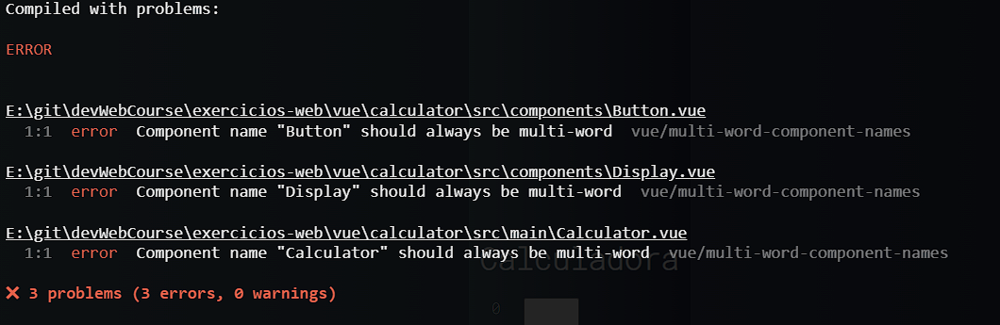
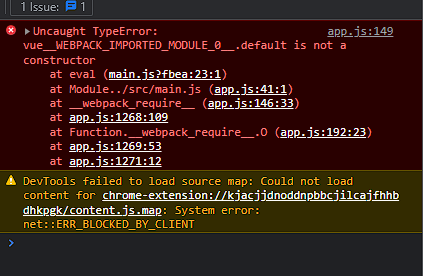

# MUDANÇAS IMPORTANTES:
* Troquei o nome da classe para app2 pois a div padrão app do vue por 
algum motivo nao esta sobre-escrevendo. Caso deixe o mesmo nome 'app', haverá duas divs com o mesmo nome e portanto, ao atribuir as propriedades do CSS abaixo do gradiente de fundo, ficará estranho.
  * 
* ERRO multi-word-name-component:
  * 
  * dado o erro que os elementos devem apresentar nome composto, tive que mudar os nomes que foram instituidos no curso da Cod3r ficando da seguinte forma:
    * Button ===> ButtonElement
    * Display ===> DisplayScreen
    * Calculator ==> CalculatorDevice
* ERRO *Uncaught TypeError: vue_WEBPACK_IMPORTED_MODULE_0__.default is not a constructor*
  * 
  * Depois de muito pesquisar e tentar recriar um projeto novo em vue, cheguei a conclusão que o erro se dá na importação do vue e na tentativa de chamar o construtor do mesmo, logo, a solução encontrada temporariamente foi utilizar o main.js base que o vue disponibiliza e os métodos ao invés do presente nas video-aulas do curso:
  ```Javascript
    // Forma presente no curso
    import Vue from 'vue';
    import App from './App';

    // Jeito 1
    new Vue({
        render(createElement){
            return createElement(App);
        }
    }).$mount("#app")

    // Jeito 2
    new Vue({
        render: h => h(App)
    }).$mount("#app")
  ```
  ```Javascript
    // Versão final com base nos arquivos padrão do próprio Vue
    // Forma atualizada de criar um app
    import { createApp } from 'vue'
    import App from './App.vue'

    createApp(App).mount('#app')
  ```

# Comandos
- Executados a partir da pasta vue:
* `npm run exercicios`: Executa o módulo de exercicios do vue;
* `npm run qrcode`: Executa o exemplo prático de vue aplicado a QRCode;
* `npm run sales`: Executa uma aplicação mais complexa de vendas feita utilizando o vue;
* `npm i -g @vue/cli`: Instala de forma global o cliente do Vue

# Comando do Vue CLI:
- `vue create calculator`: Cria um projeto de vue chamado calculator
- `vue create --help`: Exibe informações de ajuda relevantes sobre o CLI do Vue.
- `vue ui`: Exibe uma interface GUI para trabalhar com o Vue e facilitar um pouco ao invés de usar somente a CLI.
- `vue serve`: Executa o projeto em Vue.
- `npm run serve`: Executa o projeto em Vue.
  - Ou pelo Yarn com: `yarn serve`
- 

# Erros:
- `*Parsing error: No Babel config file detected*`: Adicione o bloco a seguir no arquivo `settings.json`:
```JSON
"eslint.workingDirectories": [
    {"mode": "auto"}
],
```
  - Para acessar o arquivo, pressione `Ctrl + ,` ou vá no menu File > Preferences > Settings e procure por eslint na barra de pesquisa, edite o settings.json e adicione o comando.

# Extensões do VSCode:
- Vetur(Vue Tooling for VS Code): Ajuda a criar coisas simples como um template, colocar highlight em informações importantes, formatar o arquivo e fornecer snippets do Vue.